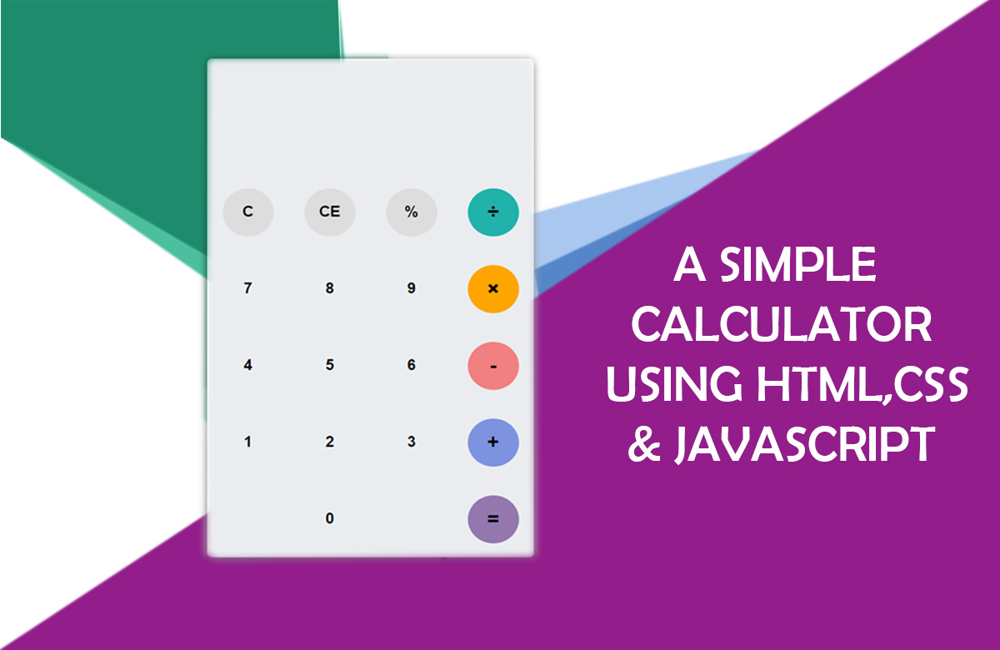

# A-simple-Calculator
A simple calculator using HTML, CSS & Javascript title-pic This is a simple calculator functionality achieved using Javascript. The logic is very simple with the minimum lines of code possible.

